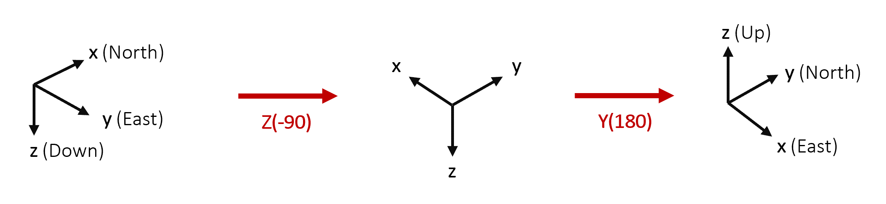

.. _definingalocalreferenceframe:

User-defined Local Frame
########################

Generic Aiding functionality allows users to define a local coordinate system 
for some measurement types. Currently supported types are:

- Position
- Velocity
- Attitude
- Heading

More detail on how to use the local frame with each update type can be found in 
the relevant document for the individual update type. 

Define the frame
================

This local frame is defined by two components:

- **Translation**: (Lat, Long, Alt) in the WGS84 global frame. This sets the origin of the local coordinate frame in the global frame.

- **Rotation**: (Yaw, Pitch, Roll) angles relative to the North, East, Down 
  local coordinate frame. These angles follow the :math:`Z_1 Y_2 X_3` convention. 
  The rotation matrix is constructed from these values using the following formula:

.. math::

   R = Z_1 Y_2 X_3 = 
   \begin{bmatrix}
   c_1 c_2 & c_1 s_2 s_3 - s_1 c_3 & c_1 s_2 c_3 + s_1 s_3\\
   s_1 c_2 & s_1 s_2 s_3 + c_1 c_3 & s_1 s_2 c_3 - c_1 s_3\\
   -s_2    & c_2 s_3               & c_2 c_3              \\
   \end{bmatrix}
   \label{TaitBryanMatrix}

To make use of the local frame, the user must define the local coordinate frame 
in the configuration of the INS. Doing so requires the advanced commands:

.. code-block::

   -gad_lrf[lrf_id]_[lat]_[lon]_[alt]_[yaw]_[pitch]_[roll]
   -gad_lrf_id[stream_id]_[lrf_id]

See :ref:`advancedcommands` for more information.

Note that this aiding type only supports right-handed coordinate systems.

Example
=======

As an example, we define the rotation between the East, North, Up (ENU) local 
reference frame and North, East, Down (NED). We start with the NED frame and 
rotate around the Z axis, then Y, then X to align it to ENU. This will provide 
the correct angles for Yaw, Pitch, and Roll respectively.

From the above diagram, we can see that the required rotations are 
:math:`-90^{\circ}` around the z axis, followed by 180&deg; around the y axis. 
No rotation is required around the x axis. The advanced command is then:

.. code-block::

   -gad_lrf1_51.9151949168643_-1.2440690876840934_94.597_-90.0_180.0_0.0

The Latitude, Longitude, and Altitude are independent of the orientation of the 
local reference frame. They will need to be determined based on the location of 
the origin of the local frame on the Earth.

A simple way to verify whether the rotation has been defined correctly is to 
create the rotation matrix from the yaw, pitch, and roll angles and apply it to a dummy point :math:`p_{user}` in the user-defined local frame.

.. math::

   Rp_{user} = p_{ned}

For most rotations, it is clear whether this point is in the correct place in the NED frame.

To assign the local reference frame (1) to a stream id (128), use the following command:

.. code-block::

   -gad_lrf_id128_1
   

It is possible to define more than one local reference frame:

.. code-block::

   -gad_lrf1_51.9151949168643_-1.2440690876840934_94.597_-90.0_180.0_0.0
   -gad_lrf2_52.9155379168678_-1.2440693776840221_94.597_0.0_-180.0_0.0
   -gad_lrf_id128_1
   -gad_lrf_id129_2
   
   
   
   

