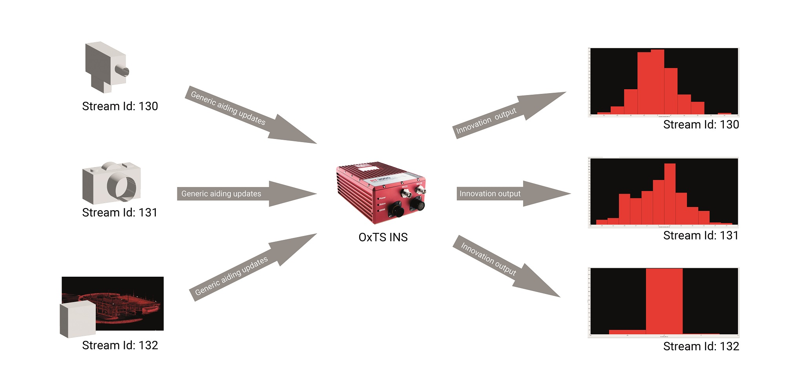

.. _myfirstgadexample:

My First GAD
#############

This is the simplest example of Generic Aiding. The full source code for this 
example can be found in `/examples/gal/my-first-gad.cpp`.

In this example, velocity data is sent to an OxTS INS in real time. 

Recommended prior reading:

- Building the SDK (README.md)
- :ref:`introduction`

Requirements
============

- An OxTS INS with the relevant Generic Aiding Feature Codes enabled. If you 
  are not sure whether you have the right Feature Codes or are unfamiliar with 
  them, contact support@oxts.com.
- A PC, connected to the INS via ethernet.
- The GAD SDK has been built on this machine / pre-built binaries have been 
  downloaded (not currently available).

Method
======

How to run the executable.

Linux 
-----

1. Navigate to the relevant directory in the build folder: 
   `cd <build_dir>/examples/gal`.
2. Run the executable: `./my-first-gad-example <IP> <Packets>`. This will begin 
   sending Generic Aiding packets to the specified IP address, which should be 
   set as the IP address of the INS, 
   e.g. `./my-first-gad-example 192.168.25.10 1000`. 
   
Windows
-----

1. Navigate to the relevant configuration type directory in the build folder: 
   `cd <build_dir>/examples/gal/Debug`.
2. From the command line run the executable: `my-first-gad-example.exe <IP> <Packets>`. This will begin 
   sending Generic Aiding packets to the specified IP address, which should be 
   set as the IP address of the INS, 
   e.g. `my-first-gad-example.exe 192.168.25.10 1000`. 

Source Code Breakdown
=====================

Here we run through the source code, explaining the purpose of each of the lines.

.. code-block:: c++

   #include "oxts/gal-cpp/gad.hpp"
   #include "oxts/gal-cpp/gad_handler.hpp"

These are the two includes required for most users of Generic Aiding. `gad.hpp` 
contains the `Gad` class used to form the basis of all Generic Aiding Data. 
`gad_handler.hpp` contains the `GadHandler` class, which provides functionality 
to encode and send the data packets.

Now we enter the `main()` function:

.. code-block:: c++

   int main(int argc, char * argv[])
   {
    ...
     std::string unit_ip   = argv[1];
     int num_packets       = argv[2];

There are two input arguments for this executable: the IPv4 address of 
the INS which will be receiving the data, and the number of packets to send. 
Note that there is no advanced parsing or error handling to check that the 
argument has been inputted correctly. The other variable here sets the number 
of packets to send.

.. code-block:: c++

   OxTS::GadVelocity gv = OxTS::GadVelocity(130);
   gv.SetVelNeu(0.0,0.0,0.0);
   gv.SetVelNeuVar(0.1,0.1,0.1);
   gv.SetTimeVoid();
   gv.SetAidingLeverArmFixed(0.0,0.0,1.0);
   gv.SetAidingLeverArmVar(0.01,0.01,0.01);

Next, we set up the velocity data with stream ID 130. 

The velocity is set in the North, East, Up (left-handed) coordinate system. 
Since we are creating *static* data, the velocity is zero in all axes. The 
covariance values for this data are set using the function 
:cpp:`SetVelNeuVar()`. For more information on covariances, see 
:ref:`estimatingerrors` or :ref:`velocitycovariancematrix`. 

The function :cpp:`SetTimeVoid()` indicates that the data will be sent with no 
timestamp, making it the simplest way to handle timing when working with 
Generic Aiding. In this setup, the INS will timestamp the packet upon receipt. 

The final step to fill out the data packet is to set the lever-arm between the 
IMU and the aiding device. Each object has its own frame of reference, and how we describe movement depends on the frame of reference being used.

For example, picture yourself stood on a train platform. Imagine you can see someone stood inside the train carriage looking for a seat. As the train pulls out of the station the person starts to walk towards the rear of the train. From the person’s point of view, they are walking forwards at a constant speed. But to you, looking into the train from the platform’s reference frame, the person initially appears not to be moving—because they’re walking forwards (in their frame) at the same speed as the train is moving forward in its frame. As the train gets faster, however, the person will appear to move in the direction of the train’s travel. To you, they are moving backwards, but to the person on the train, they are still moving forward. Both points of view are correct, they’re just using different frames of reference.

Luckily most inertial navigation systems are smart enough to be able to convert movement from one frame of reference to another – as long as they’re given a little bit of information to begin with. So imagine holding an INS upside down, so the z-axis points up. As long as we tell the INS it’s being held upside down before we start, then when you move your hand upwards the inertial measurement unit will register a positive value on the z-axis (which points down as far as it’s concerned) – but the inertial navigation system (the computer) knows it’s actually being held upside down in your hand. So it spins all the measurements around and puts them into a different reference frame that makes sense to us; one that says the INS is moving upwards.

The lever-arm is a 3D translation in the IMU frame 
from the IMU (marked on the case of the INS) to the aiding device, measured in 
metres. The covariance values on this lever-arm are then set according to how 
accurately each translation could be measured including rotation errors. 

.. code-block:: c++

   OxTS::GadHandler gh = OxTS::GadHandler();
   gh.SetEncoderToBin();
   gh.SetOutputModeToUdp(unit_ip);

This block of code initialises an instance of the `GadHandler` and sets it up 
to send binary Generic Aiding data via UDP. 

.. code-block:: c++

   for (int i = 0; i < num_packets; ++i)
   {
     gh.SendPacket(gv);
     std::cout << "packet " << i << " sent" << std::endl;
     OxTS::Sleep(100);
   }

This final code block creates a `for` loop in which the Generic Aiding data is 
encoded and sent via UDP to the INS. With :cpp:`OxTS::Sleep(100)`, the data 
will be sent at a rate of ~10Hz.

Is my data being received by the INS?
=====================================

If you are unsure whether the INS is using the GAD, see 
:ref:`ismydatabeingreceived`.
 

Example
=======

A camera that measures position might use 130 for its GAD packet stream Id. This stream Id is carried through the system and output with each camera’s update. In NCOM, for example, status channel 95 will include the stream id with the innovations and time. By monitoring NCOM status channel 95 you can tell whether the GAD update was received, how it matched the navigation solution and whether it was accepted by the navigation system. See the [NCOM manual](https://www.oxts.com/wp-content/uploads/2022/09/OxTS-NCOM-Manual.pdf) for details on NCOM status channel 95. If two (or more) cameras are used then the effect of each camera can be analysed independently by assigning a different stream Id to each camera.

Notes
=====

The current version of the NCOM decoder has not yet been updated to decode status channel 95. NCOM has limited bandwidth for status channels and so some updates will be skipped if there are too many.

Future versions of NAVdisplay may include visualisation tools to help analyse generic aiding sensors and will use the stream Id to separate different sensors.

Stream Id 0 to stream id 128 are reserved for internal use and will be ignored on the generic aiding interface. Stream Id 128 to stream Id 254 should be used. Note that currently there are no recommendations for which numbers to assign to which types of sensor though this may change in the future.

Some generic aiding updates require configuration. For example, to use a local reference frame (XYZ measurements instead of latitude, longitude and altitude) the origin and orientation of the local reference frame need to be defined in advance. The configuration is associated with a stream Id and each stream Id can have a different configuration.

Recommended next steps:
======================

- Read more on creating aiding for each type: :ref:`aidingtypestoc`.
- See a more complex example: :ref:`staticaidingexample`.
