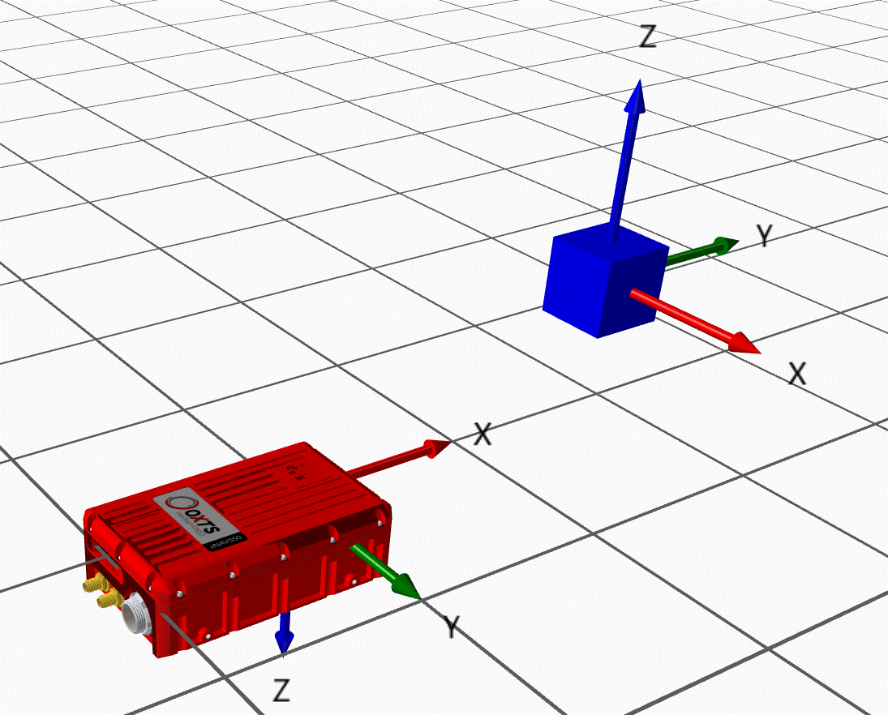
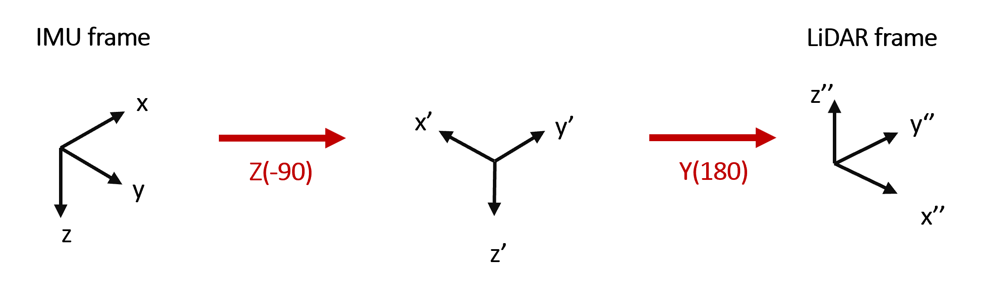

.. _gadvelocitypage:

Velocity
********

The GA interface allows users to send a number of measurement updates to an 
OxTS INS from external devices/ sensors, including velocity estimates. Each of 
the fields for this data type can be set using functions from the 
:ref:`gadvelocityclass` class.

.. _velocityaidingframes:

Aiding Frames
=============

Velocity aiding can be provided to the INS in more than one coordinate frame, based on the needs of the user.

.. _velocityaidingframesneu:

North, East, Up frame
---------------------

The NEU frame is the simplest way to provide velocity aiding to the INS, since it requires no other configuration. Note that this is a left-handed coordinate system.

Velocity measurements in this frame are expected in :math:`m/s`. 

.. _velocityaidingframeslocal:

User-defined Local frame 
------------------------

Velocity aiding supports a user-defined local frame. More information on how to define the frame itself can be found on the relevant page.

Velocity measurements in this frame are expected in :math:`m/s` . 

.. _velocityaidingframesodometry:

Odometry frame (beta)
---------------------

For this aiding frame, data is expected in the frame of an odometry sensor fixed to the vehicle. In order to use this frame, the transformation between the sensor and the INS must be specified in the INS configuration. This can be done with advanced commands in NAVconfig or in the mobile.cfg file directly on the unit.

The odometry frame requires a rotational transformation as well as the standard lever arm, which is specified in much the same way in the config file:

.. code-block::

   -attitude[att_id]_[heading]_[pitch]_[roll]_[var_hea]_[*var_pit]_[*var_roll]
   -gad_on[stream_id]
   -gad_att_id[stream_id]_[att_id]

The `-attitude` option sets the orientation of the sensor frame with respect to the IMU frame.  The angles are defined intrinsically, following the Tait-Bryan :math:`Z_1 Y_2 X_3` convention in degrees.
The `var_pit` and `var_roll` inputs are optional, with the `var_hea` option being used for all 3 variances if the others are not specified. Note you must specify either one or three variances.

The `-location` option specifies the lever arm :math:`(x,y,z)`. This defines the translation from the IMU to the aiding sensor, in the IMU frame. See the lever arm documentation for further information.

.. _velocityodomexample:

Example
^^^^^^^

Defining the lever arm in the IMU frame is relatively intuitive, but finding 
the angles of rotation can be less so for those who have not done it before. 
Hence, we provide an example.

Say we are using a LiDAR as our odometry source, and we want to define the 
YPR angles.

We can do this by most intuitively by starting with the LiDAR frame and 
rotating it until it aligns with the IMU frame. This is shown in the diagram 
below:

Once we have these, the configuration option can be added:

.. code-block::

   -gad_on130
   -attitude3_90.0_180.0_0.0_0.1
   -gad_att_id130_3

.. warning::

   This update frame requires that the lever arm is set to fixed in the packet,
   otherwise the data will not be used by the INS. The values are irrelevant: 
   actual values are taken from the config options.

.. _velocitycovariancematrix:

Covariance matrix
=================

All aiding provided to the INS must come with a covariance matrix. This is 
necessary to give the Kalman Filter some indication of confidence in the data 
being provided, which it can then use to inform its decision to use / reject 
the data.

For velocity aiding, the values in covariance matrices are currently expected 
with units :math:`(m/s)^2`. For example, a covariance matrix where motion in 
all axes is found to be (or assumed to be) independent might look like this:

.. math::

   \begin{bmatrix}
   0.01 & 0.0  & 0.0  \\
   0.0  & 0.01 & 0.0  \\
   0.0  & 0.0  & 0.01 \\
   \end{bmatrix}
   \label{CovExampleMatrix}

This matrix shows that 

.. math:: 

   \sigma_x \sigma_x = \sigma_y \sigma_y = \sigma_z \sigma_z = 0.01 (m/s)^2 .

.. _velocitylva:

Lever Arm
=========

Velocity measurements must be provided with a lever arm :math:`(x,y,z)` which 
defines the translation from the IMU to the aiding sensor, in the IMU frame. 

