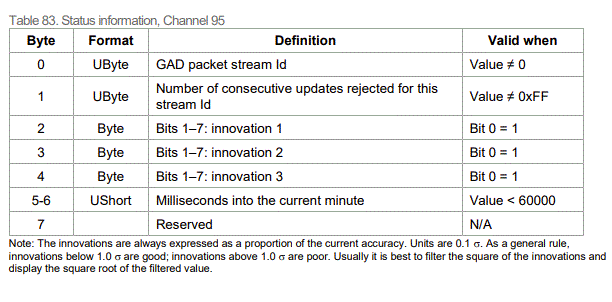

.. _ncomupdates:

NCOM Output
###########
When the INS receives a GAD packet with valid time it will output the packet on status packet 95.
This packet is scheduled at 1Hz.

The innovations will match the stream type and not all innovations will be valid for 
all stream types, for example;  attitude innovation updates will only use innovation1 and innovation2
measurements.

Note also when using many streams there may be issues getting updates from a specific stream as
this status channel will always return data from the last received GAD packet when the packet is sent.
