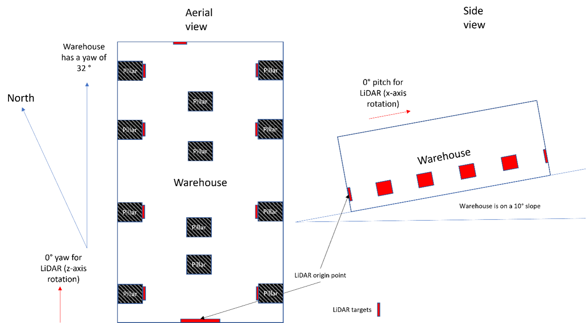
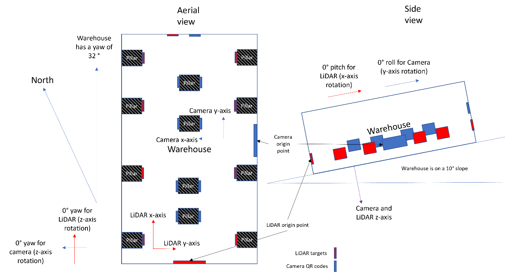
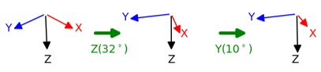
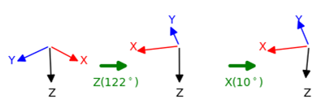

.. _Frames:

Frames
******

All aiding data will be in a specific coordinate frame. Which frame will depend on your sensors orientation and the type of data you it's transmitting.
Furthermore, the INS can interpret aiding data in different frames, giving you flexibility when it comes to how you transmit the data. 

There are three major types of frame that you’ll deal with:

	**Global frames** are frames that describe location or movement relative to the earth. Global updates in GAD include Geodetic position, NED velocity, Attitude, and Heading. 
	
	**Local frames** are frames that describe location or movement relative to a local fixed point and orientation. 
	
	**Body frames** are frames which are moving with the vehicle, e.g. odometry-frame velocity or vehicle-frame speed.

**User-defined local frame**

Position, velocity, and heading data types can be sent in a user-defined local frame. A user-defined local frame is one you create yourself, starting from a known point in space. To do this, you need two pieces of information:

	1.	Your origin point in the WGS84 global coordinate frame (latitude, longitude, and altitude). This gives the system the ability to convert the data into the global frame, which your INS will do in real time.
	2.	The difference rotation between your local coordinate frame and the global coordinate frame, relative to North, East, Down (NED). This is specified by using a rotation matrix of the Euler angles (Tait-Bryan convention :math:`Z_1 Y_2 X_3`):
	
	.. math::

		R = Z_1 Y_2 X_3 = 
		\begin{bmatrix}
		c_1 c_2 & c_1 s_2 s_3 - s_1 c_3 & c_1 s_2 c_3 + s_1 s_3\\
		s_1 c_2 & s_1 s_2 s_3 + c_1 c_3 & s_1 s_2 c_3 - c_1 s_3\\
		-s_2    & c_2 s_3               & c_2 c_3              \\
		\end{bmatrix}
		\label{TaitBryanMatrix}
	
	.. collapse:: caption
	
		1. 1, 2, 3 represent the angles :math:`{\alpha}`, :math:`{\beta}` and :math:`{\gamma}` , i.e. the angles corresponding to the first, second and third elemental rotations respectively.
		2. X, Y, Z are the matrices representing the elemental rotations about the axes x, y, z of the fixed frame (e.g., X1 represents a rotation about x by an angle :math:`{\alpha}`).
		3. s and c represent sine and cosine (e.g., s1 represents the sine of :math:`{\alpha}`).
	
You can create up to 32 local reference frames in a dataset, and each needs to be assigned a local reference frame ID and linked to a stream ID, so the INS knows which frame to use for which aiding data. There are a few reasons why you might have multiple local reference frames:

	1.	You might have two different aiding devices using different local frames in the same space. For instance, a LiDAR scanner using reflective targets with one origin point, and a camera using QR codes with a different origin point.
	2.	You might want to use the same device in two separate locations, which have different local frames. In this case, you would need to remember to switch the stream ID for your aiding data when you moved from site 1 to site 2.

An example
----------

Let’s say you have a LiDAR scanner and a camera mounted to your vehicle, which you are using to survey a warehouse (which in this example is a perfect cuboid). 
The warehouse is set up like this (note that the drawing is not to scale, the angles and measurements are for reference only.):

.. figure:: assets/warehouse.png
	
	
The LiDAR scanner uses a series of targets to orient itself, while the camera uses a series of QR codes. Both devices can give you position, velocity, and heading data – so you want to create a user-defined local frame for each of them. You would first need to ascertain their origin points in the WGS84 global coordinate frame, which you do using a total station and a quick bit of maths. Let’s say that:

	1.	LiDAR scanner
	
		a.	Lat: 51.91519
		b.	Long: -1.24407
		c.	Alt: 94.6
	2.	Camera
	
		a.	Lat: 51.91571
		b.	Long: -1.24269
		c.	Alt: 111.9

Next, you need to define what rotations are needed to transform from your local frame to the global coordinate frame. This has to be relative to the NED coordinate frame that your INS uses.

For your LiDAR, the origin point is on a wall, and assumes that everything forward of that wall is North (0°). But the warehouse itself is in fact pointing to 32° (its heading to use the proper terminology) and is on a slope of 10° (its pitch). 

	
To make matters more complex, your camera’s origin point is on a different wall, meaning that it deviates from the global coordinate frame by a yaw of 122° and the 10° difference is now in the roll rather than the pitch.

	
For each coordinate frame, you need to describe these rotations so that the INS can correctly compensate when it’s matching up the data. Those transformations look like this:

LiDAR: Rotate about the Z axis by 32°, then about the Y axis by 10°, and don’t rotate about the X axis (as it’s already aligned to the global coordinate frame).

	Diagram showing the rotations of the LiDAR frame (32° around the Z axis, then 10° around the X axis).

Camera: Rotate about the Z axis by 122°, don’t rotate about the Y axis (as it’s already aligned to the global coordinate frame), then rotate about the X axis by 10°.

	Diagram showing the rotations of the camera frame (122° around the Z axis, then 10° around the Y axis).
	

The next step is to set the user-defined local frame(s) in the INS' configuration file:

.. code-block:: c

	-gad_lrf[lrf_id]_[lat]_[lon]_[alt]_[z]_[y]_[x]
	
Note that:

•	[lrf_id] refers to the local reference frame ID (start at 2).
•	[lat], [long], and [alt] refer to the WGS84 coordinates of your origin point
•	[z], [y], and [x] refer to the rotations needed to align your local frame with the global frame 

To assign a stream ID to that local reference frame, you then need to add the following line:

.. code-block:: c

	-gad_lrf_id[stream_id]_[lrf_id]

So, to return to our example above, the code that sets local frames for each of our aiding devices and assigns them to the right stream ID would look like this:

.. code-block:: c

	-gad_lrf2_51.915_-1.244_94.597_32.0_10.0_0.0
	-gad_lrf3_52.916_-1.244_94.597_122.0_0.0_10.0
	-gad_lrf_id133_2
	-gad_lrf_id134_3

In this code:

	**Line 1** is setting the first user-defined local frame, using the WGS84 coordinates and setting the z, y, and x rotations.
	
	**Line 2** is setting the second user-defined local frame.
	
	**Line 3** is telling the system to use the first user-defined local frame for stream 133 (the LiDAR).
	
	**Line 4** is telling the system to use the second user-defined local frame for stream 134 (the camera).

