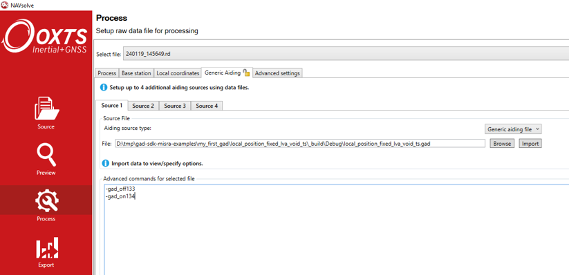

.. _postprocessing:

Post-processing GAD data
########################

While real-time GAD/INS integration can be extremely powerful in aiding your navigation data, 
it is sometimes necessary to combine your INS and GAD data in post-processing.

Reasons for doing this may include:

*	A sensor being misscalibrated and needing to be corrected. 
*	Covariance values that need to be tuned from an initial estimation.
*	Debugging GAD data that does not behave as expected.

With this in mind, it is important to understand how to create a GAD file, and how to use it in post-processing.

A GAD file is a CSV style file, with the extension “.gad”. Each row of the file displays the information of one GAD packet. 
While each column corresponds to different fields within a packet.

For a more in-depth description of the structure of the GAD file, see :ref:`here <GAD_columns>`.

.. _GAD_files:

Creating GAD files
******************

GAD files contain generic aiding data packets in CSV format, using UTF-8 encoding. They can be recognised by the file extension “.gad”. There are two ways to create them:

1.	Instruct Gadhandler to export GAD data to a GAD file.
2.	Extract the GAD data from the INS’ raw data (RD) file using NAVsolve.  

**Option 1: using the SDK**

When setting up GadHandler, you will add in a section of code that determines how the data will be encoded and output (see :ref:`s3_example_code` for an example). 
Here you can instruct GadHandler to create a GAD file using the following command:

.. tabs::

   .. code-tab:: c++

	OxTS::Gal_Cpp::GadHandler gh;
	gh.SetEncoderToCSV();
	gh.SetOutputModeToFile([filename]);

		
   .. code-tab:: py
		
	gad_hand = oxts_sdk.GadHandler()
	gad_hand.set_encoder_to_csv()
	gad_hand.set_output_mode_to_file([filename])

Note that [filename] = whatever name you want to give the file.

Your data will now be stored as a GAD file. 
Note that if you do this, the data will not be received by your INS, and thus not stored in the RD file – your GAD file will be the only copy of the data.

**Option 2: using NAVsolve**

Once you have finished your measurements, your INS will have one or more RD files saved on it. 
You can use our post-processing software, NAVsolve, to extract the GAD from the RD file and save it as a GAD file. To do this, follow these steps:

*	Ensure that your version of NAVSuite is 3.9.2309.22 or newer. See here to download the latest of NAVSuite.
*	In NAVSolve’s “Source” page, select the relevant RD file and its corresponding .cfg file.
*	Navigate to the "Process" page and select the "Generic aiding" tab. Upload the relevant GAD file and select "Aiding source type" as "Generic aiding data" from the drop-down menu.
*	In the text box in the bottom half of the screen, add in the advanced command shown below. Note you will need to add this command for each GAD data stream.
*	Process the data in NAVsolve.
*	The .gad file will be created at the end of the processing.

The advanced command to add into the config file is:

.. code-block:: c

	-gad_csv_output_[X]

Note that X can be:

1.	“off”: this will turn off the .gad file output
2.	“immediate”: this will create a .gad file, outputting the data before the timestamp has been resolved to full GPS time. This can be useful for debugging. HOWEVER, if you have used the Void or Latency timestamps when creating your GAD packet, using this option will produce data with no time attached to it, making it useless for post-processing. 
3.	“resolved”: this will create a .gad file, outputting the data once it has been resolved to full GPS time. This is generally better for post-processing.
4.	“as_used”: this will create a .gad file, but will only include the data that the INS chooses to process, removing data that was ignored because it arrived too late or that was deemed inaccurate.

Including GAD files in post-processing
**************************************

Timestamping
------------

In order for the data in the GAD file to be processed correctly, each gad packet needs an accurate timestamp.
In some cases your sensor device will provide a timestamp. 
See :ref:`Timestamping <time_stamp>` on how to use the SDK to write this timestamp directly to the GAD file.

However, if your sensor does not provide a timestamp, the data will have to be sent to the OxTS INS in real-time as it is being taken. 
(This should be done with the :ref:`void or latency <time_stamp>` timestamp types.)
As the data is received by the INS, it will apply a GPS time stamp to each GAD packet (taking into account any latency that has been applied). 
The GAD file with full time GPS timestamps can then be extracted from the RD file by processing the data with the advanced command `-gad_csv_output_resolved` in the .cfg file.

Using NAVSolve to post-process data with a GAD file
---------------------------------------------------

The RD file can post-processed with a GAD file using NAVSolve:

•	Ensure that your version of NAVSuite is 3.9.2309.22 or newer. See `here <https://support.oxts.com/hc/en-us/sections/115000789105-NAVsuite>`_ to download the latest of NAVSuite.
•	In NAVSolve's "Source" page, select the relevant RD file and its corresponding .cfg file.
•	Navigate to the "Process" page and select the "Generic aiding" tab. Upload the relevant GAD file and select "Aiding source type" as "Generic aiding data" from the drop-down menu.
•	If the GAD file was created directly from the SDK, then add the command to turn on the relevant gad stream(s) in the text box in the bottom half of the screen. (`gad_on[Y]`, where `[Y]` is the stream ID).
•	If the GAD file was extracted from the RD file, then the stream IDs need to be manually changed in the GAD file to a ID number that is not in use. (This can be done relatively easily with a spreadsheet program such as Excel.)
	Once the stream IDs have been changed, enter in the command(s) to turn off the stream ID(s) of the gad packets in the RD file (`gad_off[Y]`, where `[Y]` is the stream ID). 
	Then enter the command(s) to turn on the stream ID(s) in the GAD file. See the image below for an example.
•	Note that NAVsolve can process up to four GAD files at once.
•	Run NAVsolve on the RD file.

The results of the post-processing can be viewed by opening the NCOM file in NAVgraph. The effectiveness of Generic aiding can be determined by post-processing the data with and without the GAD stream(s) turned on.
Both sets of data can be simultaneously viewed in NAVgraph.

