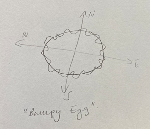
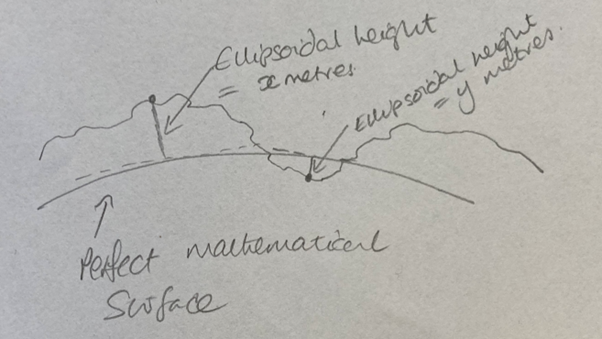

.. _Gloss_of_terms:

Glossary of terms
*****************

•	**Aiding device**

Any sensor or device that you want to connect to your INS to add additional data to your final output. Typically referred to as “a generic aiding device”, examples include wheel speed monitors, LiDAR sensors, cameras, accelerometers, or a car’s internal telemetry systems. Aiding devices produce generic aiding data – also known as GAD.

•	**Aiding frame**

See frame.

•	**CAN bus**

Standing for Controller Area Network, a CAN bus is the standard message-based protocol designed to allow the different systems in a vehicle to communicate with each other. It can be used to extract telemetry data from the vehicle, effectively turning the vehicle into an aiding device.

•	**Covariance**

Covariance is a mathematical concept that describes the relationship between two sets of variables.
:ref:`Learn more about Covariance. <cov>`

•	**Data packet**

A data packet is a set of data transmitted over a digital network.

•	**Frame**

A frame of reference for your data. Every aiding device will provide data in a specific frame, which dictates how you provide the aiding data to your INS. When using the GAD SDK, you will need to specify the frame of the data you are transmitting.
:ref:`Learn more about frames. <Frames>`

•	**GAD**

Stands for Generic Aiding Data, and refers to any data from an aiding device that you plan to pass through the INS to contribute to your activity. 

•	**GadHandler**

GadHandler is the name of a class that sends GAD data packets from your aiding device to your INS or to a GAD file. 
GadHandler will be hosted on the processor that sits between the GAD and INS. 

•	**Generic Aiding Data (GAD) Interface**

The GAD interface is all of the code that you can use to create GadHandler, and what allows your aiding device to communicate with your INS. 

•	**Generic Aiding Device**

See Aiding Device

•	**GNSS**

Global navigation satellite system (GNSS) is a generic term to cover the global satellite positioning systems orbiting Earth. There are four systems in operation (called “constellations”) that OxTS INS devices can use to establish their location. See also GPS.

•	**GNSS repeater**

A GNSS repeater is a device for getting a GNSS signal in a location where you wouldn’t normally be able to. It works by taking a GNSS signal, transmitting it through a cable to a rebroadcast station, and then rebroadcasting that signal to devices nearby. GNSS repeaters are useful for getting an accurate GPS time in a GNSS-denied environment, though they are NOT useful for getting a GNSS position – because the position the repeater broadcasts is the position of the initial receiver, not the position of the vehicle (though you could use it as an origin point for a user-defined local frame).

.. note::

	**GNSS repeater licence**
	
	Because of their potential to cause interference with other RF systems in its vicinity, most telecom regulators require users to obtain a licence to operated GNSS repeaters. 

•	**GPS**

GPS is one of the most common GNSS systems in use today, operated by the US Space Force. Its prevalence is such that GPS has become a catch-all for any GNSS system, but if you’re working with an INS it’s important to understand that there are other GNSS constellations available to you (specifically the Russian GLONASS, Chinese BeiDou, and the European Galileo systems).

•	**GPS time**

GPS time is a format of time used by GNSS satellites. It’s a continuous time scale (meaning it doesn’t change for things like leap years or clocks going forwards/backwards) and is measured in weeks since 6th January 1980. It’s one of the formats you can use to timestamp your GAD.
:ref:`Learn more about timestamping. <time_stamp>` 

•	**IMU**

IMU stands for inertial measurement unit. The IMU is a core piece of technology in an INS. It’s a collection of gyroscopes and accelerometers that detect and measure INS’ orientation, accelerations and angular rates. Using these variables, it calculates the direction and distance travelled. 

•	**INS**

Stands for inertial navigation system. An INS is a vital part of any payload, and is vital to this documentation as it is all about connecting additional aiding devices to an INS. For more details on what an INS is, see our website.

•	**Kalman filter**

A Kalman filter is an algorithm that uses a series of measurements to produce an estimate of a value that would be more accurate than a single measurement. It does this by trusting values with a higher degree of certainty over those with less.
:ref:`Learn more about the Kalman Filter. <KF>`

•	**Latency**

In the context of GAD, latency refers to the delay between the measurement being taken and it arriving at your INS. Identifying the latency of your measurements is important for ensuring your data all hangs together.

•	**Lever arm**

A lever arm is a set of measurements that describe the distance from the INS to your aiding device, from the perspective of the INS. It’s expressed as (x,y,z) measurements in metres and is included in every GAD packet.
:ref:`Learn more about lever arms. <lever_arms>`

•	**LiDAR**

Light Detection And Ranging is the name given to a type of remote sensor that can be used as a generic aiding device. LiDAR works by transmitting pulses of light, and detects how those pulses take to return to the sensor (exactly like how radar and sonar work, except they use radio waves and sound waves, respectively). While LiDAR is typically used to survey the area around the sensor, you can also use the data to calculate the sensor’s odometry; or if you already know the position of certain objects in your environment,  the sensors location can be estimated, i.e., a SLAM algorithm.

•	**Message ID**

A message ID may be included in the data that is transmitted from your aiding device, if your device transmits data using the message format. It denotes what kind of aiding data is being transmitted; GadHandler can be programmed to watch for specific message IDs in order to include the right aiding data in the packet it sends to the INS.

•	**Origin point**

An origin point is a defined point in space that your payload will use to measure its position. In the world of GAD, origin points are encountered when creating a user-defined local reference frame, as in order to function, that frame needs an origin point which you can locate using WGS84.
:ref:`Learn more about user-defined local frames. <Frames>`

•	**PPS**

Standing for pulses per second, PPS is how many computers measure internal time. They are very fast and very stable; PPS can be used to measure time down to the nanosecond. PPS is used in the synchronisation of clocks between devices in your payload, and can be used to timestamp data.
:ref:`Learn more about timestamping. <time_stamp>` 

•	**RD file**

A raw data file. These files are created automatically by the INS, containing the data from the INS and any generic aiding devices you have connected. They can be used to create GAD files.
:ref:`Learn more about GAD files. <GAD_files>`

•	**SLAM**

Short for Simultaneous Location And Mapping, SLAM is a technology that allows a sensor to create a map of its environment while also tracking its location within that environment.

•	**Stream ID**

Stream IDs are used to identify the different data streams that are passed to the INS.
Stream IDs for GAD data can be any number between 129 and 254, and each data stream needs a unique ID in the system you are building. 
(Stream IDs 0 to 128 are reserved for internal use and will be ignored on the generic aiding interface.)

•	**Struct**

Short for Structure. A structure is a collection of variables under one name.

•	**TAI time**

International Atomic time (the acronym comes from the French term). This is a highly accurate time standard maintained by a global collection of atomic clocks. It’s the basis for Coordinated Universal Time (UTC) and is a format you can use to timestamp your data.
Learn more about timestamping. 

•	**UDP**

Stands for User Datagram Protocol, which is one of the core communications protocols used in internet communications. 

•	**UNIX time**

A time measurement widely used in computing. It is displayed as a count of seconds since 1st January 1970. You can choose to give your GAD a UNIX timestamp.
:ref:`Learn more about timestamping. <time_stamp>` 

•	**Urban canyon**

An urban canyon is an urban area in which a large volume of tall buildings makes it hard for your INS device to lock on to enough GNSS satellites to get a reliable location heading.

•	**UWB**

Ultra-Wideband is a form of radio technology that can be used to help identify an object’s position. It uses very low amounts of energy and transmits data over a large portion of the radio spectrum (hence the name).

•	**WGS84**

The World Geodetic System 1984 (WGS84) is a coordinate system used to locate points on the earth. It recognises that Earth is not a precise sphere. With flattened north and south poles, and a contoured surface, it would probably be more appropriate to describe the earth as a bumpy egg! 
WGS84 defines a perfect mathematical ellipsoid which is a good approximation of the shape of the planet. It uses latitude and longitude (in degrees) to define an object’s position on the surface of that ellipsoid. A third coordinate, altitude (also known as ellipsoid height or geodetic height), gives the perpendicular distance of an object from the ellipsoid’s surface in metres. Because the earth is bumpy, the altitude value can be negative if the Earth’s surface sits below the ellipsoid’s surface.

	

