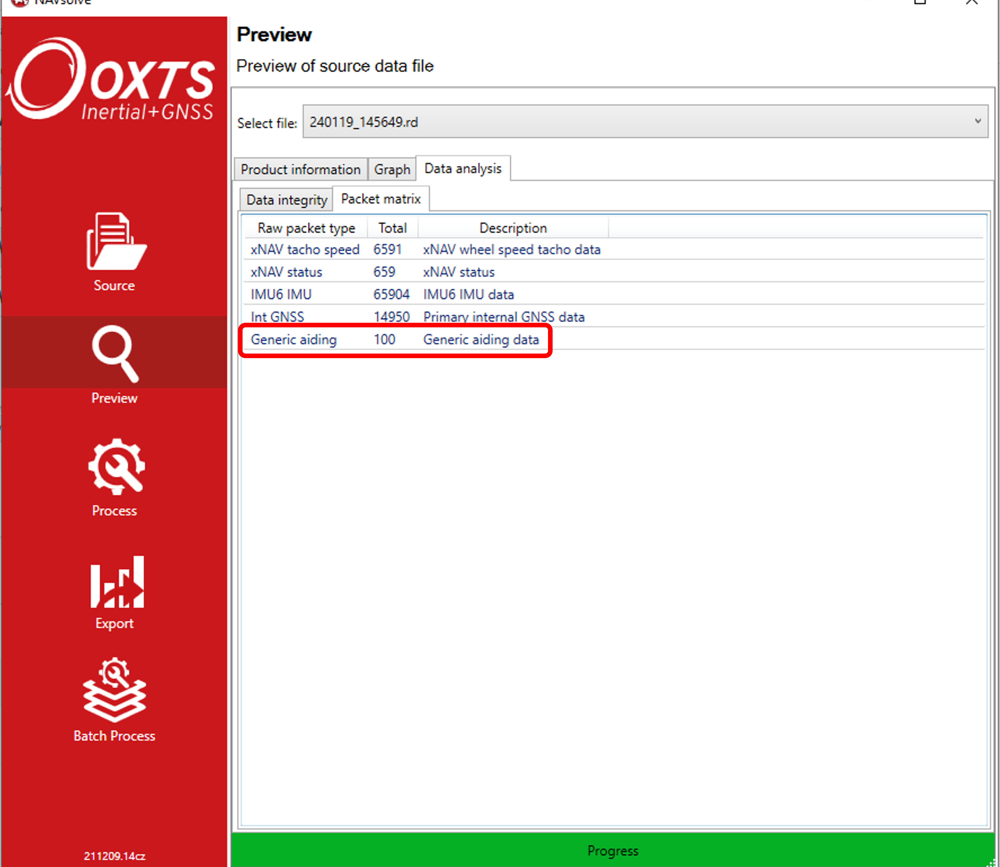

.. _debuginformation:

Debug Information
#################

This section lays out some of the ways you can determine whether your 
real-time integration of the GAD data with the INS is working correctly. 
If you wish to determine whether your GAD data is being used correctly 
during post-processing, see :ref:`Post-processing GAD data <postprocessing>`.

Is my data being formatted correctly?
*************************************

Before sending your aiding data to an OxTS INS, it can be useful to check that
your GAD-SDK code is working as intended, i.e. the GAD packets have the correct format.
See :ref:`GAD file <GAD_files>` for information on a file's structure. 

.. _Data_received:

Is my data being received?
**************************

The first step on the road to GAD being used by the INS is for the packet to arrive via UDP. 
Currently, there is no GAD packet count message being outputed in real time, 
so the best way to determine whether GAD packets are being logged by the INS is to open the corresponding raw data (RD) file in NAVsolve. 
Here, in Preview->Data analysis, you can find the Packet Matrix (see image below). 
If GAD packets are logged, then they will be included in this list.

Another way to check whether the GAD packets are being received, is to include the 
`-gad_csv_output_immediate` :ref:`advanced command <GAD_files>` when post-processing 
your RD file. This command  will produce a CSV file (extension .gad) that lists the packets 
that were received (but not necessarily used) by the INS unit.

Generic Aiding Data packets will always be logged by the INS, even if the 
appropriate Feature Codes are not enabled. But without the appropriate Feature 
Codes the packets will not be used in the navigation solution. 

If your GAD packets are not listed in the RD file packet matrix, or if no .gad file is produced, 
that means they are not arriving at the INS. Often, this indicates that there is an issue in the network configuration. 
Some common things to check:

* Check the IP address of the INS against the IP being used by the 
  :code:`GadHandler` to send packets to.
* Check that the IP address of the device encoding GAD packets is on the same 
  subnet as the INS. 

.. _Data_used:

Is my data being used?
**********************

.. note::

    Ensure that the .cfg file loaded onto the INS unit has the command(s) 
    to turn on the correct GAD stream(s). The command is: `-gad_on[Y]`, where
    `[Y]` is the stream ID. You will need to use this command for each 
    GAD stream that is being sent.

Since the INS is selective about which data it trusts to use in updates, it is 
entirely possible for GAD to be rejected by the system because it is 
deemed inaccurate, or does not match its internal state. 

Feedback about whether GAD is being used by the system currently varies 
depending on the aiding type being sent. Generally, it is useful to have access 
to NAVdisplay during this process.

GAD contained in an RD file can be extracted from the RD file to CSV in 
post-processing, which can be a useful tool for debugging reasons why GAD is 
not being used by the INS. To find out more, see :ref:`GAD_files`.

Innovations measurements can be extremely useful in understanding the behaviour 
of the INS, and why it is accepting / rejecting certain aiding streams. Note 
that in NCOM, innovations for aiding types are mixed with all other streams of that 
aiding type. For example, GAD Position will be included in the position 
innovations alongside GNSS position (if GNSS is being used). Information on NCOM can be found 
here: :ref:`NCOM_output`.

Innovations can be viewed in real-time in NAVdisplay and on post-processed in NAVgraph.

Innovations can be thought of as a measure of the degree to which a measurement 
is "surprising" to the navigation engine. For example, when the INS estimates 
that it has a high degree of accuracy, an incoming position update with a high 
accuracy (small variance) which disagrees with the navigation of the INS itself 
will be "surprising" and produce a high innovation. This can lead to the INS 
rejecting the aiding update as an outlier.  

Conversely, an incoming low accuracy (high variance) aiding update which 
roughly agrees with the INS will have a small innovation, as the information 
from the aiding update does not conflict with the INS' own information. This will 
also lead to the update having a smaller impact on the overall navigation 
solution.

When the system is working well, innovations generally look like white noise, 
normally distributed around zero. Consistently small innovations with mean zero 
suggest an aiding source has a loose covariance, which may be tightened. Large 
innovations (>3.5) with mean zero suggest the covariance is too small, and 
should be loosened. 

Any consistent bias in innovations suggests systematic errors in the system, 
either from the aiding source itself or the configuration of the overall system - 
e.g. a local reference frame which has been configured with the incorrect 
altitude.

Position
========

- GPS Position mode will change to: :code:`Gen Aid (34)`. 
- The reported accuracies for position should reflect those provided 
  by the aiding source.
- Position innovations

Velocity
========

- GPS Velocity mode will change to: :code:`Gen Aid (34)`. 
- The reported accuracies for velocity should reflect those provided 
  by the aiding source.
- Velocity innovations

Speed
=====

- The reported accuracies for speed should reflect those provided 
  by the aiding source.
- Wheelspeed innovations

Attitude
========

- The reported accuracies for heading and pitch should reflect those provided 
  by the aiding source.
- Attitude innovations

Heading
=======

- Heading accuracy reflects the accuracy of the aiding updates.
- Heading innovations.

.. note:: 
  
  There are cases when the aiding mode will change to :code:`Gen Aid (34)` but 
  the system is not using the Generic Aiding data. This can be identified by the 
  reported accuracies not reflecting the accuracies of the aiding data.
