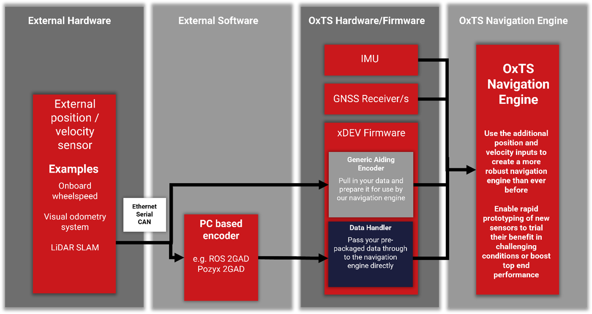

.. _overview:

Overview of GAD SDK
####################################

What is Generic Aiding Data (GAD)?
**********************************

An Inertial Navigation System (INS) combines acceleration and angular rate data from its inertial measurement units (IMUs), 
and data from one or more external aiding sources to estimate its position, orientation, velocity, and other measurements of its dynamics. 
The most commonly used aiding source is the Global Navigation Satellite System (GNSS). 
(All OxTS INS’s come with GNSS receivers as a built-in aiding source.) GNSS is an excellent source of aiding data, 
able to provide centimetre-accurate position and velocity globally with minimal infrastructure burden on the end user.

.. note::

    We recommend that before you start to use GAD, you familiarise yourself with 
    using your OxTS INS with GNSS as the aiding source. Doing this will give a 
    solid foundation in understanding the use of GAD. Learning resources can be 
    found on the `OxTS website <https://support.oxts.com/hc/en-us>`_.

However, no single aiding sensor, even GNSS,  can provide a reliable estimate of position and orientation in all conditions and environments. 
For example, places prone to multipath errors such as urban canyons, can significantly reduce the accuracy of GNSS measurements. 
Furthermore, GNSS-denied spaces such as underground car parks, will mean that no aiding source is available. 
For short periods of time the lack of an accurate aiding source can be compensated for by the “dead reckoning” navigation data provided by the IMUs. 
The drawback is that IMUs have limited means of providing an absolute position relative to any global system beyond the pose at the time they were powered on. 
Additionally, measurements of acceleration and angular rate must be integrated to produce velocity and position data, 
meaning they accumulate errors over time and consequently are prone to drift. 

Thus, it makes sense to combine multiple aiding sources, that work in different environments, to gain the benefits of their differing properties. 
This concept is referred to as sensor fusion and allows for users to get high quality data in a variety of environments. 
Examples of this approach include UWB-based indoor navigation solutions such as 
`Posyx2GAD <https://www.oxts.com/products/pozyx2gad/>`_, and LiDAR-based 
odometry aiding in the form of 
`OxTS LIO <https://www.oxts.com/products/lidar-inertial-odometry-lio/>`_. 

Generic Aiding is an extension of these principles, creating an interface between 
an OxTS INS and sensor of your choice.
The key is that it is generic: as long as the data is provided in the right 
format, you can use any sensor you choose.

Examples of sensors that can provide these aiding data types include (but 
are not limited to):

* Wheelspeed sensors
* LiDAR (SLAM or odometry output)
* Cameras
* RADAR
* Ultra-wideband (UWB) devices
 
While there are a multiple use cases for GAD, they all revolve around the same 
core principle: different sensors have different error models, and fusing 
measurements from multiple sensors can generate higher-accuracy navigation in a 
greater number of environments.

What does GAD SDK do?
*********************

The GAD SDK provides C, C++, and Python libraries which can be used to package 
your measurement data as Generic Aiding. This data can be send  to an INS 
via ethernet, and be used in the sensor fusion process in real-time. 
Or it can be stored in a file for use when post-processing with the INS data.

Please note, the OxTS GAD SDK is compliant with the Motor Industry Software 
Reliability Association (MISRA) coding standards.

There are currently five types of aiding data which can be provided to your INS 
through the GAD interface:

1.	Position
2.	Velocity
3.	Speed
4.	Attitude
5.	Heading

Alongside the measurement itself, the navigation engine requires a few other 
pieces of information in order to make proper use of the incoming aiding data:

* **Timestamp.** When was the measurement taken? 
* **Coordinate frame.** Every device will output measurements in a different 
  frame of reference, based on the type of sensor. Some may use a global frame 
  like WGS84, whilst others only measure relative to the vehicle itself such as 
  as a speed-over-ground sensor.
* **Lever arm / Alignment.** Where is the sensor on the vehicle relative to 
  the INS unit?
* **Measurement accuracy (covariance).** Providing an estimate of the accuracy 
  of an aiding measurement gives a sensor fusion algorithm the means to weight 
  measurements as they are combined. Higher-accuracy updates are allowed more 
  influence in the overall navigation solution.  

For each of these additional pieces of information, the GAD SDK provides 
options for the user which aim to cater to varying levels of integration.

How might an integration look?
******************************

There are many ways the GAD SDK can be integrated into your workflow. 
However, the basic concept is:

* Build your system, connecting your aiding sensor(s) and the INS to a central computer 
  (whether that’s a laptop, single board computer, or similar) which has the GAD SDK code installed.
* During a test, your aiding device begins generating measurements.
* That data is sent to the processor, where it is converted into GAD packets.
* These GAD packets are the sent to the INS, where they are combined with the 
  INS' own internal data streams. (Note that you can opt to write the data to a 
  file instead, either for debug or to be used in post-processing)
* The output from the INS (typically NCOM format) will then be the  
  navigation solution based on aiding data all sensor(s) and the IMUs measurments. 
  It can be consumed in the normal way. 

	
	A process diagram showing how data flows from your aiding device.
	
	
